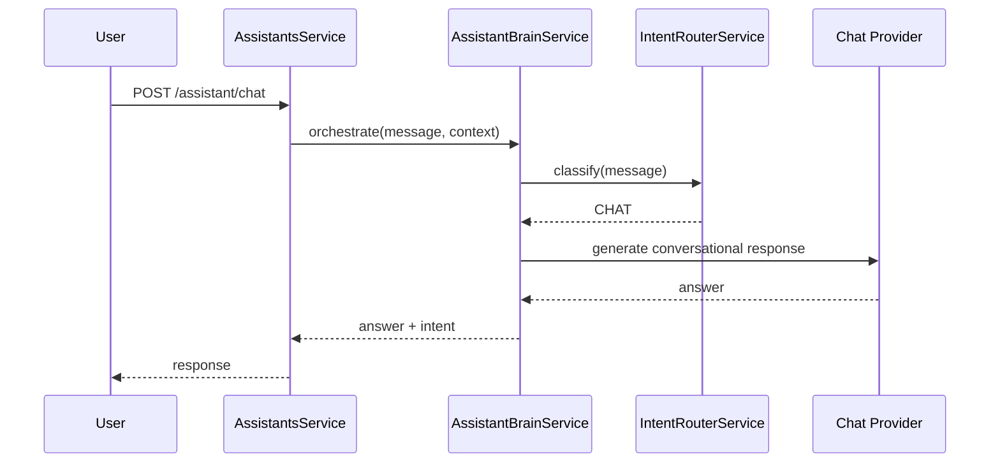
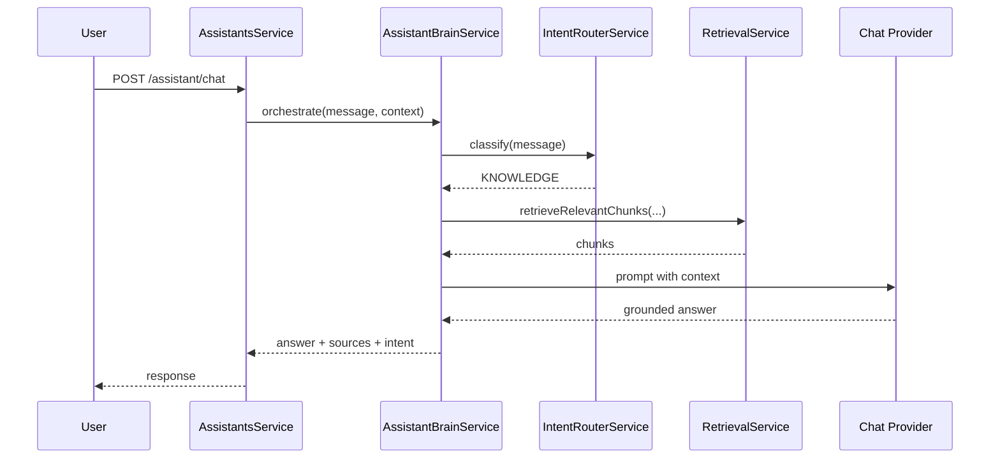
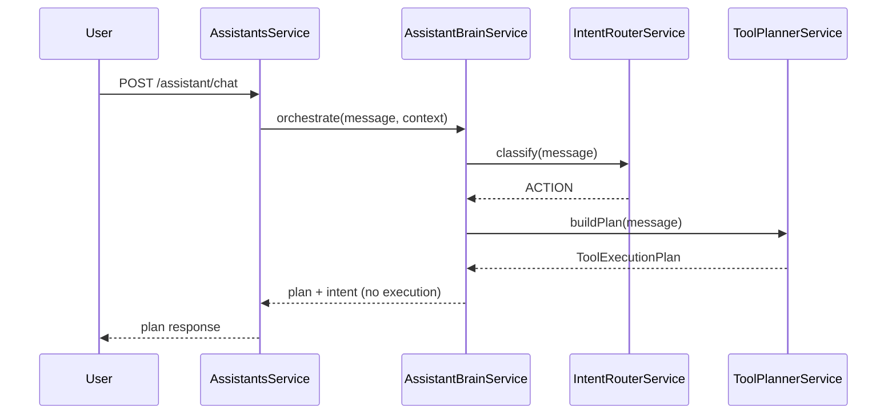
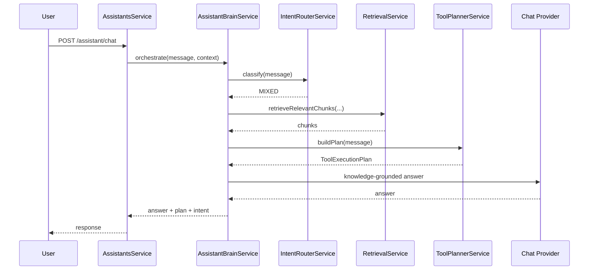

# Assistant Brain (Phase 3 Foundation)

## Purpose

`modules/assistant-brain` is the orchestration layer between user intent and platform execution.

This phase is architecture-only:

- No external tool integrations
- No tool execution engine
- No calendar/gmail/http/web-search implementation

The brain decides **what should happen**, but does not execute anything.

## Core Principle

The LLM can reason and generate language.

The platform executes side effects.

Therefore, the assistant must never claim actions were completed unless the platform returns an explicit successful execution result.

## Components

### 1) IntentRouterService

Deterministic classifier that maps each request into exactly one `AssistantIntent`:

- `CHAT`
- `KNOWLEDGE`
- `ACTION`
- `MIXED`

Current implementation is rule-based and intentionally simple, designed to be replaced later by an LLM classifier without changing orchestration contracts.

### 2) AssistantIntent enum

Shared intent contract for routing and telemetry.

### 3) ToolPlannerService

Builds a `ToolExecutionPlan` for `ACTION`/`MIXED` requests:

- `toolName`
- `reason`
- `confidence`
- `parameters`
- `missingInformation`
- `requiresUserConfirmation`

The output is only a plan. No tool is executed in this phase.

### 4) AssistantBrainService

Orchestrates flow:

1. classify intent
2. route behavior:
   - `CHAT`: conversational answer
   - `KNOWLEDGE`: RAG answer
   - `ACTION`: plan only (no execution)
   - `MIXED`: RAG answer + plan

It centralizes orchestration while preserving existing authentication, RBAC, memory, conversation, and retrieval foundations.

## Future Tool Names (defined only)

- `calendar.create_event`
- `calendar.delete_event`
- `gmail.send_email`
- `gmail.read_email`
- `web.search`
- `http.request`
- `database.query`
- `crm.search_customer`
- `erp.get_invoice`

Only names are defined now to keep the architecture open for future execution engines.

## Why this prevents hallucinated actions

Without this architecture, a model may answer in a way that implies execution happened.

With assistant-brain:

1. action-like requests are explicitly detected
2. platform returns a **plan**, not an execution result
3. prompts explicitly forbid claiming side effects
4. execution remains a separate, auditable platform concern

This separation drastically reduces "fake completion" responses.

## Sequence Diagrams

### A) CHAT

### B) KNOWLEDGE (RAG)

### C) ACTION (Plan only)

### D) MIXED (Knowledge + Plan)

## Next phase boundary

Phase 3 ends at planning and intent routing.

The next phase will add:

- Tool Registry
- Execution Engine
- explicit execution result contracts returned to the assistant
