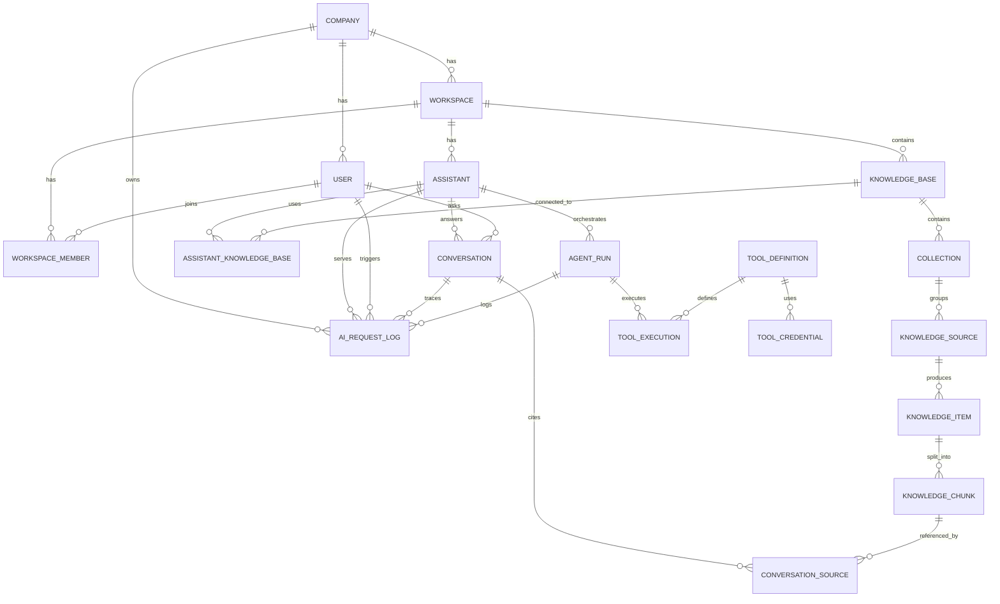

# AI Business Assistant Platform - Entity Relationship Diagram

This ERD reflects the enterprise knowledge + automation architecture:
- knowledge-centric domain model,
- assistant-to-knowledge-base reuse,
- agent/tool execution traces,
- complete AI observability.

## Mermaid ER Diagram

---

## Relationship Notes

1. `KnowledgeSource` abstracts all connector types, with PDF as MVP implementation.
2. `KnowledgeItem` provides a canonical normalized representation of ingested content from any source.
3. `AssistantKnowledgeBase` supports many-to-many reuse between assistants and knowledge bases.
4. `AgentRun` and `ToolExecution` capture the orchestration lifecycle and tool invocation history.
5. `AIRequestLog` stores intent, selected tools, retrieved knowledge, prompts, responses, and errors.
