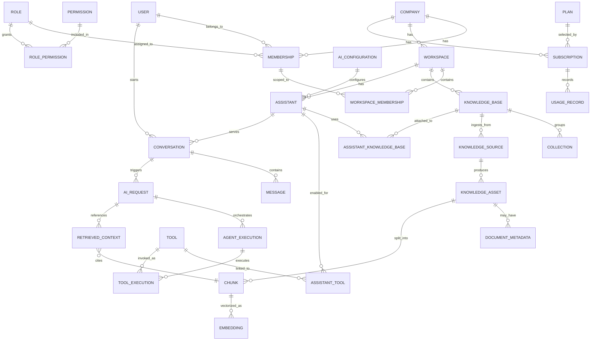

# Enterprise AI Knowledge Platform - Entity Relationships

This document describes relationship topology across domains.

---

## 1) High-Level Relationship Map

---

## 2) Relationship Rules by Domain

## Identity
- `User <-> Company` is many-to-many via `Membership`.
- `Membership` is the canonical tenant access anchor.
- `Membership` can be further constrained to workspaces via `WorkspaceMembership`.

## Workspace
- One company has many workspaces.
- All workspace entities must inherit company lineage.

## Knowledge
- `KnowledgeBase` belongs to workspace.
- `KnowledgeSource` belongs to knowledge base (and optionally collection).
- `KnowledgeAsset` belongs to source and is canonicalized regardless of source type.
- `Chunk` belongs to asset; `Embedding` belongs to chunk.

## Assistant
- Assistant belongs to workspace and can link to multiple knowledge bases.
- Assistant can enable multiple tools through `AssistantTool`.
- Assistant uses one active `AIConfiguration` (or versioned config strategy later).

## Agent Runtime
- Conversation stores user/assistant thread.
- AIRequest stores each orchestrated question/response trace.
- AgentExecution and ToolExecution break down execution internals.
- RetrievedContext links requests to evidence chunks.

## Subscription (future)
- Company can have current and historical subscriptions.
- Usage records tie metered events to subscription periods.

---

## 3) Tenant and Workspace Constraints

1. `workspace.company_id` must match parent company.
2. Any `assistant.workspace_id` must match linked knowledge bases/tools unless explicitly global.
3. `ai_request` and related execution rows must match assistant/workspace/company lineage.
4. `retrieved_context` must reference chunks from same tenant boundary.
5. All unique constraints should account for soft delete (`deleted_at is null` strategy).

---

## 4) Indexing Strategy Summary

Core index categories:
- **Tenant routing**: (`company_id`, `workspace_id`)
- **Operational timelines**: (`created_at`), (`status`, `created_at`)
- **Join performance**: foreign keys and composite join indexes
- **Retrieval**: vector index on embeddings + metadata filter indexes
- **Uniqueness with soft delete**: partial unique indexes on active rows

---

## 5) Recommended Referential Behaviors

General guidance:
- Use `RESTRICT`/`NO ACTION` for critical parents in active systems.
- Prefer soft delete over cascading hard deletes.
- For audit-heavy tables (`AIRequest`, `ToolExecution`), keep historical rows even if parent entities are archived.

---

## 6) Evolution Notes

- Start relationally strict for identity/workspace boundaries.
- Keep certain configs in JSON initially (`config_json`, `policy_json`), then normalize once usage stabilizes.
- Add partitioning/archival strategy early for `AIRequest`, `ToolExecution`, `UsageRecord` as data grows.
