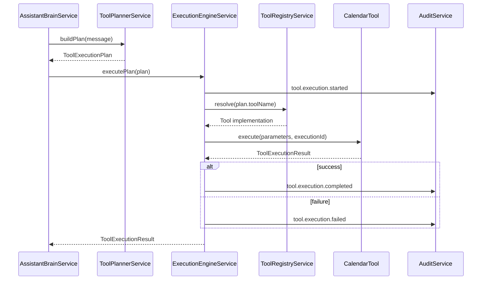

# Phase 4.1 - Execution Engine Foundation

## Objective

Introduce a minimal production-ready execution framework that can run a `ToolExecutionPlan` synchronously without external integrations.

This phase adds execution architecture only. It does **not** add OAuth, provider APIs, retries, queues, workflows, or scheduling.

## Components

### Tool interface

All tools implement the same contract:

- `name()`
- `description()`
- `schema()`
- `execute()`

This keeps the execution engine generic and decoupled from specific vendors.

### ToolRegistryService

Resolves a tool implementation by `toolName` from the execution plan.

If the tool is not registered, execution fails deterministically with `TOOL_NOT_FOUND`.

### ExecutionEngineService

Responsible only for execution of `ToolExecutionPlan`.

Lifecycle:

1. log `tool.execution.started`
2. validate plan readiness (missing info / confirmation requirements)
3. resolve tool from registry
4. execute synchronously
5. log:
   - `tool.execution.completed` on success
   - `tool.execution.failed` on any failure

### CalendarTool (placeholder)

First tool implementation:

- name: `calendar.create_event`
- behavior:
  - validates `title`, `start`, `durationMinutes`
  - returns structured **mock** success payload
  - does not call Google Calendar

## Architecture diagram

```mermaid
flowchart TD
  U[User Message] --> B[AssistantBrainService]
  B --> R[IntentRouterService]
  R -->|ACTION| P[ToolPlannerService]
  P --> E[ExecutionEngineService]
  E --> G[ToolRegistryService]
  G --> C[CalendarTool (placeholder)]
  C --> E
  E --> A[(AuditService)]
  E --> B
  B --> API[Assistant Response]
```

## Execution flow (ACTION)



## Example execution plan

```json
{
  "toolName": "calendar.create_event",
  "reason": "User requested a meeting",
  "confidence": 0.96,
  "parameters": {
    "title": "Weekly Billing Review",
    "start": "2026-07-14T10:00",
    "durationMinutes": 60
  },
  "missingInformation": [],
  "requiresUserConfirmation": false
}
```

## Safety guarantee

The assistant must never claim an action succeeded unless `ToolExecutionResult.success === true`.

For failed execution, responses explicitly state that execution did not complete and include the failure reason.

## Adding future tools

Any future tool (Calendar, Gmail, Slack, REST API, SQL, Web Search, ERP, CRM) can be added by:

1. creating a class that implements the `Tool` interface
2. returning a unique name (e.g. `gmail.send_email`)
3. defining input schema via `schema()`
4. implementing `execute()` with deterministic result shape
5. registering the tool in `ASSISTANT_BRAIN_TOOLS` provider list

No changes are required in `ExecutionEngineService` for each new integration.
