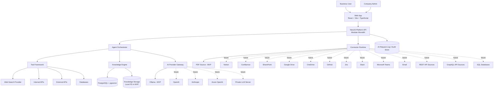

# AI Business Assistant Platform - System Context Diagram

This context diagram models the platform as an enterprise knowledge and automation system.

## Mermaid System Context Diagram

---

## Deployment Evolution Context

### MVP: Single Local Deployment
- single runtime on developer machine
- Postgres + pgvector + Ollama locally
- PDF connector, knowledge engine, chat, tool framework, web search tool

### Future: Shared SaaS
- shared multi-tenant control plane and execution runtime
- managed storage, AI provider routing, and operations

### Enterprise: Dedicated Deployment per Company
- dedicated backend runtime
- dedicated database/vector infrastructure
- dedicated connector credentials and policy boundaries
- optional dedicated/private model connectivity
