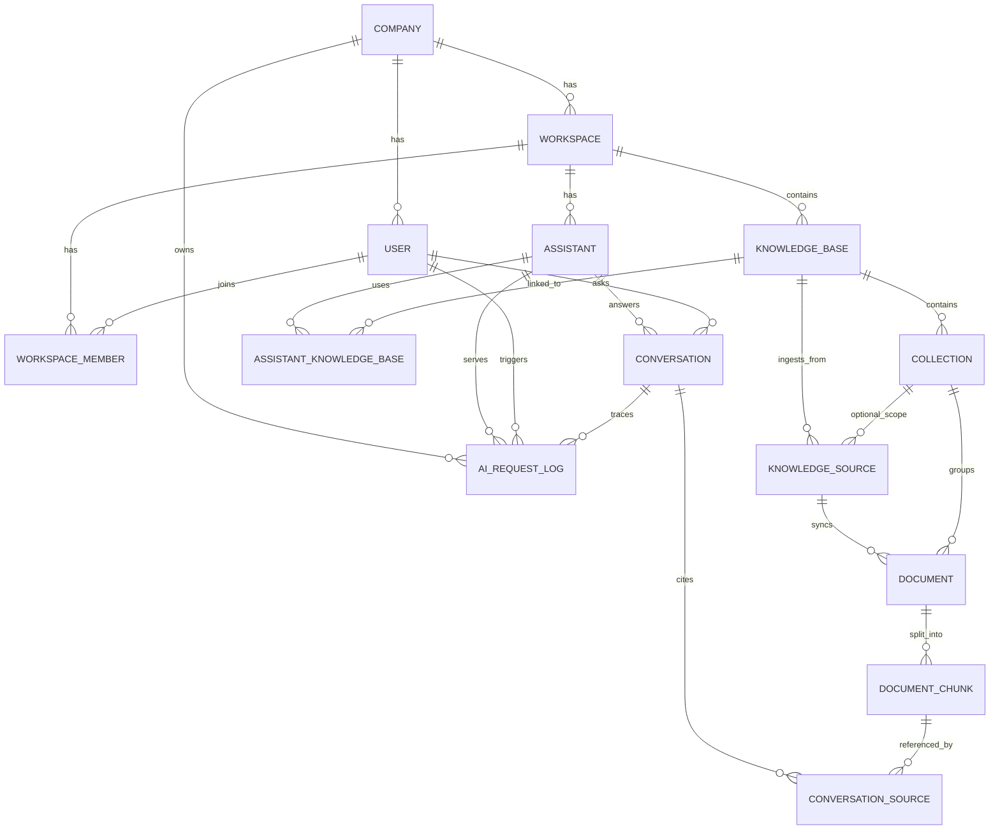

# AI Business Assistant Platform - Entity Relationship Diagram

This ERD reflects the updated architecture:
- Company -> Workspace -> Knowledge Base -> Collection -> Document -> Chunk
- Assistants consume knowledge bases (many-to-many)
- AI request logs capture full retrieval and generation trace

## Mermaid ER Diagram

---

## Relationship Notes

1. `ASSISTANT_KNOWLEDGE_BASE` enables one assistant to use multiple knowledge bases and one knowledge base to serve multiple assistants.
2. Documents are owned by knowledge structures (knowledge base/collection), not assistants.
3. `KNOWLEDGE_SOURCE` abstracts connector types (PDF now, others later).
4. `AI_REQUEST_LOG` is a core observability entity for enterprise debugging and quality tracking.
