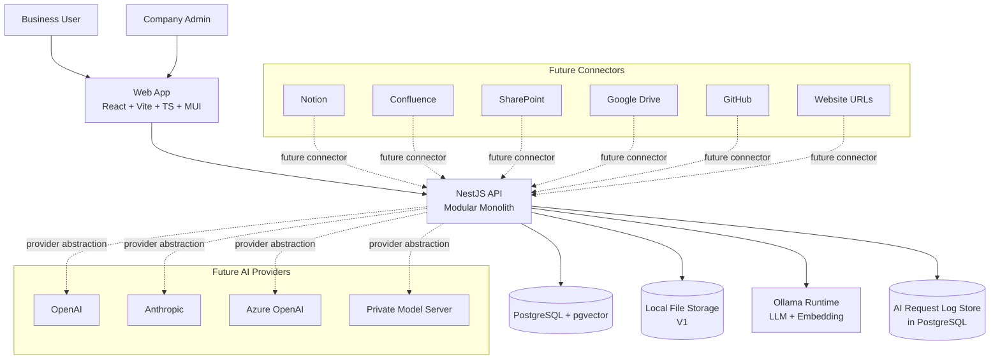

# AI Business Assistant Platform - System Context Diagram

This diagram shows system boundaries and external dependencies across evolution stages.

## Mermaid System Context Diagram (C4-style simplified)

---

## Deployment Evolution Context

### V1 (current target)
- Single local deployment on developer machine
- Local Ollama + local Postgres/pgvector
- PDF upload as first source type

### Shared SaaS (future)
- Shared multi-tenant web/api runtime
- Managed database and storage
- Hosted AI providers and/or managed inference

### Enterprise dedicated (future)
- Per-customer isolated deployment:
  - dedicated backend
  - dedicated database/vector store
  - dedicated model runtime/provider connection

The same domain model and module boundaries are preserved across stages to avoid rewrites.
